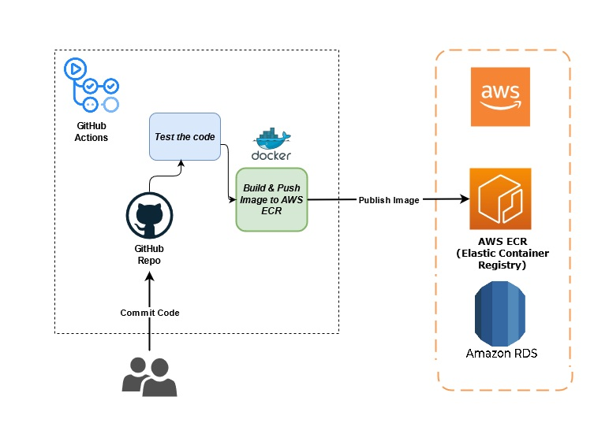

# Franquicias API

Este proyecto es una API desarrollada con Spring Boot y WebFlux para gestionar franquicias, sucursales, productos y su inventario. Además, incluye una infraestructura en AWS definida con Terraform para desplegar la aplicación.

## Tabla de Contenidos
- [Endpoints](#endpoints)
- [Infraestructura en AWS](#infraestructura-en-aws)
- [Cómo ejecutar el proyecto](#cómo-ejecutar-el-proyecto)

---

## Endpoints

### Franquicias
#### **Obtener todas las franquicias**
- **Método:** `GET`
- **URL:** `http://franquicias-acc-alb-1261943192.us-east-1.elb.amazonaws.com/api/franquicias`
- **Descripción:** Devuelve una lista de todas las franquicias.
- **Ejemplo de respuesta:**
```json
[
  {
    "id": 1,
    "name": "Franquicia A"
  },
  {
    "id": 2,
    "name": "Franquicia B"
  }
]
```

#### **Obtener una franquicia por ID**
- **Método:** `GET`
- **URL:** `http://franquicias-acc-alb-1261943192.us-east-1.elb.amazonaws.com/api/franquicias/{id}`
- **Descripción:** Devuelve una franquicia específica por su ID.
- **Ejemplo de respuesta:**
```json
{
  "id": 1,
  "name": "Franquicia A"
}
```

#### **Crear una nueva franquicia**
- **Método:** `POST`
- **URL:** `http://franquicias-acc-alb-1261943192.us-east-1.elb.amazonaws.com/api/franquicias`
- **Descripción:** Crea una nueva franquicia.
- **Ejemplo de body:**
```json
{
  "name": "Franquicia C"
}
```

#### **Actualizar una franquicia**
- **Método:** `PUT`
- **URL:** `http://franquicias-acc-alb-1261943192.us-east-1.elb.amazonaws.com/api/franquicias/{id}`
- **Descripción:** Actualiza una franquicia existente.
- **Ejemplo de body:**
```json
{
  "name": "Franquicia Actualizada"
}
```


---
### Sucursales
#### **Obtener todas las sucursales**
- **Método:** `GET`
- **URL:** `http://franquicias-acc-alb-1261943192.us-east-1.elb.amazonaws.com/api/sucursales`
- **Descripción:** Devuelve una lista de todas las sucursales.

#### **Crear una nueva sucursal**
- **Método:** `POST`
- **URL:** `http://franquicias-acc-alb-1261943192.us-east-1.elb.amazonaws.com/api/sucursales`
- **Descripción:** Crea una nueva franquicia. Devuelve Id, Nombre y Franquicia de la sucursal.
- **Ejemplo de body:**
```json
{
  "name": "Sucursal C",
  "franquiciaid": 1
}
```

#### **Actualizar una sucursal**
- **Método:** `PUT`
- **URL:** `http://franquicias-acc-alb-1261943192.us-east-1.elb.amazonaws.com/api/sucursales/{id}`
- **Descripción:** Actualiza una franquicia existente. Devuelve Id, Nombre y Franquicia de la sucursal.
- **Ejemplo de body:**
```json
{
  "name": "Sucursal Actualizada"
}
```

---
### Productos
#### **Obtener todas las Productos**
- **Método:** `GET`
- **URL:** `http://franquicias-acc-alb-1261943192.us-east-1.elb.amazonaws.com/api/productos`
- **Descripción:** Devuelve una lista de todas las productos.

#### **Crear una nueva PRODUCTO**
- **Método:** `POST`
- **URL:** `http://franquicias-acc-alb-1261943192.us-east-1.elb.amazonaws.com/api/productos`
- **Descripción:** Crea un nuevo producto. Devuelve Id y Nombre del producto.
- **Ejemplo de body:**
```json
{
  "name": "Producto A"
}
```

#### **Actualizar una producto**
- **Método:** `PUT`
- **URL:** `http://franquicias-acc-alb-1261943192.us-east-1.elb.amazonaws.com/api/productos/{id}`
- **Descripción:** Actualiza un producto existente. Devuelve Id y Nombre del producto.
- **Ejemplo de body:**
```json
{
  "name": "Producto Actualizada"
}
```

---
### Actualizar Inventario de Sucursal
#### **Añadir producto a inventario de sucursal**
- **Método:** `POST`
- **URL:** `http://franquicias-acc-alb-1261943192.us-east-1.elb.amazonaws.com/api/agregarinventario`
- **Descripción:** Registra el producto-X en la sucursal-Y con stock-Z. Devuelve dicha informacion.
- **Ejemplo de body:**
```json
{
  "idProd": 1,  // id del producto
  "idSuc": 1,   // id de la sucursal
  "stock": 3    // stock de ese producto para esa sucursal
}
```

#### **Elimina un producto de una sucursal**
- **Método:** `DELETE`
- **URL:** `http://franquicias-acc-alb-1261943192.us-east-1.elb.amazonaws.com/api/eliminarinventario/1/1`
- **Descripción:** Elimina el producto 1 de la sucursal 1 (ejemplo).

---
### El producto que más stock tiene por sucursal para una franquicia puntual
#### **Añadir producto a inventario de sucursal**
- **Método:** `GET`
- **URL:** `http://franquicias-acc-alb-1261943192.us-east-1.elb.amazonaws.com/api/franquicias/2/max-stock`
- **Descripción:** En este ejemplo, para la franquicia=1, devuelve una lista con un diccionario por cada sucursal. El cual contiene el  id_sucursal, id_relacion(sucursal-producto), stock y id_producto del producto con mas unidades en cada sucursal.
- **Ejemplo de body:**
```json
[
  {
    "stock": 33,
    "id": 2,
    "idProd": 1,
    "idSuc": 2
  },
  {
    "stock": 35,
    "id": 5,
    "idProd": 3,
    "idSuc": 3
  }
]
```

---

### Infraestructura en AWS

La infraestructura está definida en Terraform y consta de los siguientes componentes:

1. **Amazon ECS (Elastic Container Service):**
   - Cluster ECS para ejecutar la aplicación.
   - Servicio ECS con tareas que ejecutan la imagen Docker de la aplicación.

2. **Amazon ECR (Elastic Container Registry):**
   - Repositorio para almacenar la imagen Docker de la aplicación.

3. **Amazon RDS (Relational Database Service):**
   - Base de datos MySQL para almacenar los datos de la aplicación.

4. **Amazon ALB (Application Load Balancer):**
   - Balanceador de carga para distribuir el tráfico hacia las tareas ECS.

5. **Amazon CloudWatch:**
   - Logs para monitorear la aplicación.

6. **Amazon VPC y Subnets:**
   - Red virtual con subnets públicas para los recursos.

7. **Seguridad:**
   - Grupos de seguridad para controlar el acceso a los recursos.
   - Clave SSH para acceso a las instancias.

---

## Cómo ejecutar el proyecto
Para ejecutar el stack de Terraform para la infraestructura, cree un archivo variables.tfvars en la raíz, con la contraseña de la base de datos RDS como: db_password = "Password", y luego ejecute terraform apply --var-file + <variables_file>.tfvars

### Requisitos
- Docker
- Terraform
- AWS CLI configurado con credenciales

### Pasos
1. **Construir la imagen Docker:**
   ```sh
   docker build -t franquicias-api .
   ```

2. **Desplegar la infraestructura en AWS:**
   ```sh
   cd infrastructure
   terraform init
   terraform apply
   ```

3. **Ejecutar la aplicación localmente:**
   ```sh
   docker run -p 8000:8000 franquicias-api
   ```

4. **Acceder a la API:**
   - URL local: `http://localhost:8000`
   - URL en AWS: `http://franquicias-acc-alb-1261943192.us-east-1.elb.amazonaws.com/`
